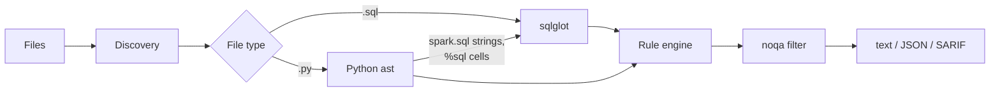

# pipeline-lint

[](https://github.com/NafiulSaputra/pipeline-lint/actions/workflows/ci.yml)

[](LICENSE)

**A linter for data pipelines that catches the bugs that only show up when a job runs twice.**

pipeline-lint checks SQL, PySpark, Databricks notebooks and Airflow DAGs for data-engineering
mistakes: appends that duplicate data on retry, overwrites that wipe a whole table, dates
hardcoded into scheduled queries, and more. It runs in seconds, needs no Spark or Airflow
installation, and plugs into pre-commit and GitHub code scanning.

```text
$ pipeline-lint check examples/
examples/dags/daily_revenue_dag.py
  13:6     warning  DE006  DAG has no retries in default_args, so any transient failure fails the run; ...
  18:13    error    DE007  catchup=True with a start_date that changes on every parse (datetime.now()); ...

examples/daily_revenue_job.py
  12:66    warning  DE003  Hardcoded date '2026-01-01' in a filter; use the run's logical date (e.g. {{ ds }}) ...
  17:9     warning  DE005  .toPandas() loads the entire DataFrame into driver memory; ...
  19:15    error    DE001  .mode("append") appends rows: re-running this job writes them again; ...
  22:15    warning  DE002  .mode("overwrite") replaces the whole table, not just this run's data; ...

examples/sql/load_orders.sql
  2:1      error    DE001  INSERT INTO analytics.fct_orders appends rows: re-running this job inserts them again; ...
  2:1      warning  DE004  SELECT * feeds INSERT INTO analytics.fct_orders: columns are matched by position; ...
  5:21     warning  DE003  Hardcoded date '2026-01-01' in a filter; ...

Found 9 violations (3 errors, 6 warnings) in 3 files.
```

## Why

Pipelines are re-run constantly: an orchestrator retries a task after a timeout, an engineer
re-runs a failed day, a backfill replays a month. Code that is correct on its first run can
silently corrupt data on the second. A plain `INSERT INTO` doubles the rows; an
`overwrite` meant for one day deletes the whole history.

These mistakes are easy to make and hard to spot in review, and they are increasingly common
as teams generate pipeline code with AI assistants: the code runs, the tests on sample data
pass, and the problem appears weeks later as a dashboard that is quietly wrong.

Existing linters do not look for them. SQLFluff checks SQL **style**. PySpark linters focus on
**performance**. Ruff's Airflow rules focus on **API usage and migrations**. pipeline-lint
focuses on **rerun safety and data correctness**, across SQL, PySpark and Airflow in one tool.

## Rules

| ID | Name | Severity | Catches | Languages |
|---|---|---|---|---|
| [DE001](docs/rules/DE001.md) | `non-idempotent-append` | error | `INSERT INTO` / `.mode("append")` that duplicates rows on re-run | SQL, PySpark |
| [DE002](docs/rules/DE002.md) | `unscoped-overwrite` | warning | Overwrite that replaces the entire table, including the `.partitionBy()` trap | SQL, PySpark |
| [DE003](docs/rules/DE003.md) | `hardcoded-date` | warning | Literal dates in filters of scheduled queries | SQL, PySpark |
| [DE004](docs/rules/DE004.md) | `select-star-into-write` | warning | `SELECT *` deciding which columns are written | SQL, PySpark |
| [DE005](docs/rules/DE005.md) | `driver-collect` | warning | `collect()` / `toPandas()` on unbounded DataFrames | PySpark |
| [DE006](docs/rules/DE006.md) | `airflow-missing-retries` | warning | DAGs with no retries | Airflow |
| [DE007](docs/rules/DE007.md) | `airflow-unsafe-catchup` | error | `catchup=True` with a missing or moving `start_date` | Airflow |

SQL is checked in `.sql` files, inside `spark.sql("...")` calls (including a query stored in a
variable first), and in `%sql` cells of Databricks notebooks. Jinja (`{{ ds }}`) and `${var}`
templates are understood, so templated Airflow and dbt-style SQL can be checked too.

## Installation

```bash
pip install pipeline-lint
# or, as a standalone tool
uv tool install pipeline-lint
pipx install pipeline-lint
```

Requires Python 3.11+. Spark, Databricks and Airflow do **not** need to be installed:
pipeline-lint reads your code, it never runs it.

## Usage

```bash
pipeline-lint check                      # current directory
pipeline-lint check pipelines/ dags/     # specific paths
pipeline-lint check . --format json      # machine-readable output
pipeline-lint check . --format sarif --output results.sarif
pipeline-lint check . --select DE001,DE002 --fail-on error
pipeline-lint rules                      # list all rules
```

| Option | Description |
|---|---|
| `--format`, `-f` | `text` (default), `json` or `sarif` |
| `--output`, `-o` | Write the report to a file |
| `--select` | Rule IDs or prefixes to run, e.g. `DE001,DE002` (replaces the config) |
| `--ignore` | Rule IDs or prefixes to skip (added to the config) |
| `--fail-on` | `warning` (default) or `error`: lowest severity that fails the run |
| `--sql-dialect` | Any [sqlglot dialect](https://sqlglot.com/sqlglot/dialects.html): `spark` (default), `databricks`, `bigquery`, `snowflake`, `postgres`, ... |
| `--config` | Path to a `pyproject.toml` (default: the nearest one) |

**Exit codes:** `0` no violations at or above `--fail-on` · `1` violations found ·
`2` usage, configuration or internal error.

## Configuration

Settings live in `pyproject.toml`. Every key is optional.

```toml
[tool.pipeline-lint]
select = ["DE"]                    # rule IDs or prefixes; default: all rules
ignore = ["DE005"]
exclude = ["notebooks/scratch/**"] # glob patterns, relative to this file
sql-dialect = "databricks"
fail-on = "warning"
```

Unknown keys and invalid values are reported as errors instead of being silently ignored.

### Suppressing a violation

Add a comment on the reported line, naming the rule:

```python
rows = small_lookup.collect()  # noqa: DE005  (lookup table, < 100 rows)
```

```sql
INSERT INTO audit.load_log VALUES ('orders', current_timestamp());  -- noqa: DE001
```

A bare `# noqa` without a rule ID is ignored on purpose, so every suppression says what it
hides. The number of suppressed violations is shown in the summary. If you also use Ruff,
add `external = ["DE"]` under `[tool.ruff.lint]` so Ruff accepts these codes.

## Integrations

### pre-commit

```yaml
# .pre-commit-config.yaml
repos:
  - repo: https://github.com/NafiulSaputra/pipeline-lint
    rev: v0.1.0
    hooks:
      - id: pipeline-lint
```

### GitHub Actions with code scanning

Findings appear as annotations on pull requests and in the repository's **Security** tab.

```yaml
# .github/workflows/pipeline-lint.yml
name: pipeline-lint
on: [push, pull_request]

jobs:
  lint:
    runs-on: ubuntu-latest
    permissions:
      contents: read
      security-events: write
    steps:
      - uses: actions/checkout@v7
      - uses: actions/setup-python@v6
        with:
          python-version: "3.12"
      - run: pip install pipeline-lint
      - run: pipeline-lint check . --format sarif --output pipeline-lint.sarif
      - uses: github/codeql-action/upload-sarif@v4
        if: always()
        with:
          sarif_file: pipeline-lint.sarif
```

## How it works



- **SQL** is parsed with [sqlglot](https://github.com/tobymao/sqlglot), one statement at a time.
- **Python** is parsed with the standard-library `ast` module. Rules follow simple variable
  assignments, so `writer = df.write` followed by `writer.mode("append")` is still recognised.
- **Rules** are small classes registered with a decorator. A rule that applies to SQL and
  PySpark implements both checks under one ID, so it is enabled, disabled and suppressed once.

## Design decisions

- **Precision over recall.** A linter that cries wolf gets disabled. When the code is
  ambiguous, pipeline-lint stays silent: `default_args` imported from another module are not
  guessed at, `.agg(...).collect()` on a global aggregate is allowed, and sentinel dates like
  `'9999-12-31'` are not reported. For the same reason, a rule for "incremental load without a
  watermark" was deferred: it cannot be detected reliably without knowing the author's intent.
- **Context-aware, not pattern-matching.** `DELETE FROM t` followed by `INSERT INTO t` is an
  idempotent load and is not flagged. `SELECT *` is only reported when it decides which
  columns get written, not in exploratory queries or `EXISTS` subqueries.
- **Explain the trap, not just the rule.** When an overwrite uses `.partitionBy()`, DE002 says
  explicitly that partitioning alone does not limit an overwrite in Spark's default mode, the
  misconception that causes the bug in the first place.
- **Never fail silently.** One unparsable statement becomes a visible notice and the rest of
  the file is still checked. A crash inside a rule stops the run with exit code 2 instead of
  reporting "all clear" for code that was never checked. Configuration typos are errors.
- **Reproducible results.** Columns are counted in characters (not UTF-8 bytes), paths in JSON
  and SARIF use forward slashes on every OS, and sqlglot is pinned to a major version because
  rules depend on the shape of its syntax tree.

The full specification is in [docs/design.md](docs/design.md).

## Limitations

pipeline-lint analyses each file on its own and does not execute code, so:

- A `DELETE` in another task or file that makes an append safe is not visible. Use `noqa`.
- SQL built with f-strings or string concatenation is not checked; its final text only exists
  at runtime.
- Variables are followed within a module, not across functions, scopes or imports.
- Retries set on individual Airflow tasks (rather than in `default_args`) are not detected.

## Roadmap

- VS Code extension with inline diagnostics.
- v0.2: incremental loads without a watermark, `MERGE` without a unique key, more dialect coverage.
- Optional autofix for safe cases.

## Development

```bash
git clone https://github.com/NafiulSaputra/pipeline-lint
cd pipeline-lint
uv sync
uv run pytest
uv run pre-commit install
```

See [CONTRIBUTING.md](CONTRIBUTING.md) for how to add a rule.

## License

[Apache License 2.0](LICENSE)
