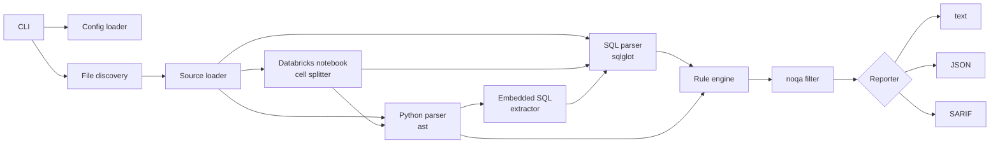

# pipeline-lint — Design Specification (v0.1)

> **Status:** Approved — implementation in progress
> **Scope:** First public release (CLI). VS Code extension is out of scope for this document.

---

## 1. Problem

Data teams increasingly generate pipeline code (SQL, PySpark, Airflow DAGs) with AI assistants.
The code usually *runs*, but it is rarely reviewed for the failure modes that matter in production
data engineering: what happens when a job is **retried, re-run, or backfilled**.

Typical outcomes:

- A plain `INSERT INTO` is retried after a timeout → **duplicate rows**, double-counted revenue.
- A `.mode("overwrite")` meant to refresh one day → **the whole table is replaced**.
- A query filters on `'2026-01-01'` → works on the day it was written, **silently wrong** afterwards.

Existing tools do not cover this:

| Tool | Focus | Gap |
|---|---|---|
| SQLFluff | SQL style and formatting | No pipeline semantics; cannot lint SQL embedded in Python (`spark.sql("...")`) |
| pyspark-antipattern, SparkDoctor, cylint | PySpark **performance** | No rerun-safety rules; PySpark only |
| Ruff (`AIR` rules), DagRuff | Airflow API usage and migration | Airflow only; no data-correctness rules |

**pipeline-lint** focuses on **rerun safety and data correctness**, across SQL, PySpark
(including Databricks `.py` notebooks) and Airflow, in a single tool.

## 2. Goals and non-goals

### Goals (v0.1)

1. Statically detect rerun-safety and data-correctness issues before code reaches production.
2. Support `.sql` files, `.py` PySpark code, Databricks source-format notebooks, and Airflow DAG files.
3. Lint SQL embedded in Python via `spark.sql("...")` (plain string literals).
4. Fit into existing workflows: CLI, pre-commit, GitHub Actions, SARIF for GitHub code scanning.
5. **Precision over recall.** A linter that cries wolf gets disabled. When in doubt, do not flag.

### Non-goals (v0.1)

- SQL style or formatting (use SQLFluff).
- Deep performance tuning (use a dedicated PySpark performance linter).
- Auto-fix.
- Runtime / data checks (use dbt tests, Great Expectations, etc.).
- dbt Jinja templating and f-string / concatenated SQL.
- Detecting whether code was written by an AI. Rules apply to all code.

## 3. Rules

| ID | Name | Severity | Languages |
|---|---|---|---|
| DE001 | `non-idempotent-append` | error | SQL, PySpark |
| DE002 | `unscoped-overwrite` | warning | SQL, PySpark |
| DE003 | `hardcoded-date` | warning | SQL, PySpark |
| DE004 | `select-star-into-write` | warning | SQL, PySpark |
| DE005 | `driver-collect` | warning | PySpark |
| DE006 | `airflow-missing-retries` | warning | Airflow |
| DE007 | `airflow-unsafe-catchup` | error | Airflow |

Each rule ships with: ID, name, severity, a one-line summary, a **rationale** (why it is wrong),
a **fix example**, and an explicit list of what it does **not** flag.

### DE001 — `non-idempotent-append` (error)

**Detects**
- SQL: `INSERT INTO <table> ...` when the same script does not delete or truncate the
  target table earlier (`DELETE FROM <table>`, `TRUNCATE TABLE <table>`).
- PySpark: `.write.mode("append")`, `.insertInto(table)` without `overwrite=True`,
  `.writeTo(table).append()`.

**Why it is wrong:** orchestrators retry failed tasks and engineers re-run jobs for backfills.
An append is not idempotent: every re-run adds the same rows again.

**Fix:** `MERGE INTO` on a business key, delete-then-insert for the processed window,
`INSERT OVERWRITE` of the processed partition, or Delta `replaceWhere`.

**Does not flag:** `INSERT OVERWRITE`, `MERGE`, `INSERT ... ON CONFLICT`, `INSERT OR REPLACE`,
Databricks `INSERT INTO ... REPLACE WHERE`, `DeltaTable.merge(...)`, streaming writes (`writeStream`).

A `DELETE`/`TRUNCATE` of the target earlier in the same file — including one issued through
`spark.sql("...")` before a PySpark append — makes the write idempotent and is not flagged.
Table names match case-insensitively, and an unqualified name matches a qualified one
(`orders` ↔ `sales.orders`), because the linter cannot know the session's current schema.

**Known limitations:** a delete performed in another task or file is invisible → use `noqa`.

### DE002 — `unscoped-overwrite` (warning)

**Detects**
- PySpark: `.mode("overwrite")` on a batch writer, and `.insertInto(table, overwrite=True)`,
  when neither `.option("replaceWhere", ...)` nor `.option("partitionOverwriteMode", "dynamic")`
  (or the `.options(...)` equivalents) appears anywhere in the writer chain.
- SQL: `INSERT OVERWRITE [TABLE] <table>` without a `PARTITION (...)` clause.

**Why it is wrong:** a job intended to refresh one partition replaces the entire table.
Note that `.partitionBy(...)` alone does **not** make an overwrite safe: under Spark's default
*static* partition overwrite mode, all partitions are still replaced. When `.partitionBy()` is
present, the message says so explicitly, because it is the most common misconception.

**Fix:** `replaceWhere` (Delta), dynamic partition overwrite, a `PARTITION` clause, or `MERGE`.

**Does not flag:** scoped overwrites; `writeTo(t).overwritePartitions()` and `.overwrite(condition)`;
`createOrReplace()` (an intentional full replacement); streaming writes; files that set
`spark.sql.sources.partitionOverwriteMode` to `dynamic` for the whole session
(`spark.conf.set`, `SparkSession.builder.config`, or SQL `SET`).

**Why only a warning:** full refreshes of small dimension tables are legitimate.

**Known limitations:** a writer stored in a variable and finished on a later line
(`w = df.write.mode("overwrite")`, then `w.option("replaceWhere", ...).save()`) is flagged → use `noqa`.

### DE003 — `hardcoded-date` (warning)

**Detects**
- SQL: a string literal that is a real calendar date or timestamp (`'2026-01-01'`,
  `DATE '2026-01-01'`, `'2026-01-01T08:00:00Z'`, also inside functions such as `to_date(...)`)
  used in a comparison (`=`, `<>`, `<`, `>`, `<=`, `>=`, `BETWEEN`, `IN`) inside `WHERE`, `ON`,
  `HAVING` or `QUALIFY`. The violation points at the literal itself.
- PySpark: inside the arguments of `.filter(...)`, `.where(...)` and `.between(...)`: date
  strings, quoted dates inside SQL expression strings (`.where("d >= '2026-01-01'")`), and
  `date(...)` / `datetime(...)` calls with literal year, month and day.

**Why it is wrong:** the query is only correct on the day it was written; scheduled runs and
backfills silently process the wrong window.

**Fix:** use the orchestrator's logical date (`{{ ds }}`, `data_interval_start`) or a job parameter.

**Does not flag:** sentinel dates (`0001-01-01`, `1900-01-01`, `1970-01-01`, `2999-12-31`,
`9999-12-31`), common in SCD Type 2 tables; templated values (`'{{ ds }}'`, `'${run_date}'`);
dates outside filters (`SELECT` list, `CASE` in projections, `withColumn`); strings that only look
like dates (`'2026-13-01'`, `'2026-01-01-backup'`).

### DE004 — `select-star-into-write` (warning)

**Detects:** `SELECT *` (or `alias.*`) whose result feeds a write: `INSERT ... SELECT *`,
`CREATE TABLE ... AS SELECT *`, the source of a `MERGE`; PySpark `.select("*")`.

**Why it is wrong:** when an upstream table adds, removes, or reorders a column, the write either
fails or — with positional inserts — silently puts values into the wrong columns.

**Fix:** list columns explicitly.

**Does not flag:** `COUNT(*)`, `SELECT *` inside `EXISTS (...)`, exploratory queries that do not write.
This is the difference from SQLFluff's generic `SELECT *` rule: only writes are flagged.

### DE005 — `driver-collect` (warning)

**Detects:** `.collect()` and `.toPandas()` in files that import `pyspark` or are Databricks notebooks.

**Why it is wrong:** all data is pulled to the driver; it works on sample data and fails with
out-of-memory errors at production volume.

**Fix:** keep the work distributed, or bound the result with `.limit(n)` first.

**Does not flag:** chains containing `.limit(...)`, and global aggregates — `.agg(...)` without
`groupBy`/`rollup`/`cube` (for example `df.agg(F.max("ts")).collect()[0][0]`, a common way to read
a watermark). Grouped aggregates are still flagged: they return one row per group.
Simple variable assignments are followed (`small = df.limit(10)` then `small.collect()` is allowed);
scopes and control flow are not.

**Note:** dedicated PySpark linters also cover this pattern. It is included because it is a
frequent issue in generated pipeline code and is the simplest rule to validate the engine end to end.

### DE006 — `airflow-missing-retries` (warning)

**Detects:** a DAG (`DAG(...)`, `with DAG(...)`, `@dag(...)`, from `airflow` or `airflow.sdk`)
whose `default_args` has no `retries`, or `retries=0`.

**Why it is wrong:** transient failures (network, warehouse locks, API rate limits) are normal.
Without retries, every blip becomes a failed run and a manual re-run.

**Fix:** set `retries` and `retry_delay` in `default_args`. Retries are only safe when tasks
are idempotent — see DE001.

**Known limitations:** retries set per task are not detected → use `noqa`.

### DE007 — `airflow-unsafe-catchup` (error)

**Detects:** `catchup=True` where `start_date` is missing or dynamic
(`datetime.now()`, `datetime.utcnow()`, `datetime.today()`, `pendulum.now()`, `days_ago(...)`).

**Why it is wrong:** with catchup enabled, the scheduler creates a run for every missed interval
since `start_date`. A missing or moving `start_date` makes that set of runs unpredictable;
combined with non-idempotent tasks, this produces duplicated or inconsistent data.

**Fix:** a fixed, timezone-aware `start_date`, or `catchup=False`.

**Note:** Ruff's `AIR` rules flag dynamic DAG arguments in general; DE007 targets the specific
catchup + start_date combination that causes unintended backfills.

### Deferred to v0.2: incremental load without watermark

Detecting a missing watermark statically requires knowing that a query is *meant* to be
incremental. Without that intent, any heuristic produces many false positives, which conflicts
with goal 5. Candidate approaches for v0.2: dbt `is_incremental()` blocks, MERGE sources with no
time predicate, or an explicit `-- pipeline-lint: incremental` marker.

## 4. Architecture



### Components

| Component | Responsibility |
|---|---|
| **Config loader** | Reads `[tool.pipeline-lint]` from the nearest `pyproject.toml`; CLI flags override it. |
| **File discovery** | Walks the given paths, keeps `.sql` and `.py`, applies `exclude` globs, skips `.venv`, `.git`, `build`, etc. |
| **Source loader** | Builds a `SourceFile` per file and classifies it: SQL, Python, or Databricks notebook (first line `# Databricks notebook source`). |
| **SQL parser** | `sqlglot`, dialect configurable (default `spark`). Parse errors never crash the run: the file is reported as skipped on stderr. |
| **Python parser** | Standard-library `ast`. |
| **Notebook splitter** | Splits cells on `# COMMAND ----------`; `# MAGIC %sql` cells become SQL statements with correct line offsets. |
| **Embedded SQL extractor** | Finds `spark.sql("<literal>")` calls — or `spark.sql(query)` where `query` was assigned a literal — and parses the text as SQL, mapping lines back to the Python file. |
| **Template masking** | Replaces Jinja (`{{ ds }}`, ``) and `${var}` with a placeholder before parsing, preserving line numbers, so templated Airflow/dbt SQL can be checked. |
| **Rule engine** | Runs every enabled rule on every source; collects `Violation` objects. |
| **noqa filter** | Removes violations suppressed on their line. |
| **Reporters** | Turn the list of violations into text, JSON, or SARIF. |

### Core data model

```python
class Severity(StrEnum):
    ERROR = "error"
    WARNING = "warning"


@dataclass(frozen=True)
class Violation:
    rule_id: str  # "DE001"
    severity: Severity
    path: Path
    line: int  # 1-based
    column: int  # 1-based
    message: str


@dataclass(frozen=True)
class SqlStatement:
    expression: sqlglot.exp.Expression
    line: int  # line in the original file where the statement starts
    column: int  # exact for .sql files, 1 for SQL extracted from Python/notebooks
    origin: Literal["sql_file", "spark_sql", "notebook_magic"]


@dataclass
class SourceFile:
    path: Path
    text: str
    kind: Literal["sql", "python", "databricks_notebook"]
    python_ast: ast.Module | None
    sql_statements: tuple[SqlStatement, ...]  # all SQL in the file, ordered by line
    notices: tuple[ParseNotice, ...]  # SQL statements that could not be parsed
```

### Rule interface

```python
class Rule(ABC):
    id: ClassVar[str]
    name: ClassVar[str]
    severity: ClassVar[Severity]
    summary: ClassVar[str]
    rationale: ClassVar[str]
    fix_example: ClassVar[str]

    def check_sql(self, source: SourceFile) -> Iterator[Violation]:
        # Receives the whole file: some rules need earlier statements (DELETE before INSERT).
        return iter(())

    def check_python(self, source: SourceFile) -> Iterator[Violation]:
        return iter(())
```

Rules register themselves with a `@register` decorator. A cross-language rule (DE001–DE004)
implements both methods under a single rule ID, so users configure one rule, not two.

**Line numbers:** SQL is split into statements from sqlglot's token stream, and each statement
is parsed separately. SQL violations are reported at the statement's start line. Parsing per
statement also means one unsupported statement becomes a *notice* (shown, never failing the run)
instead of hiding the rest of the file.

## 5. Configuration

```toml
[tool.pipeline-lint]
select = ["DE"]              # rule IDs or prefixes to enable (default: all)
ignore = ["DE005"]           # rule IDs to disable
exclude = ["tests/fixtures/**", "notebooks/scratch/**"]
sql-dialect = "spark"        # any sqlglot dialect: spark, databricks, bigquery, snowflake, postgres...
```

Precedence: CLI flags > `pyproject.toml` > built-in defaults.
`tomllib` (standard library since Python 3.11) is used, so there is no extra TOML dependency.

## 6. Suppression (`noqa`)

```python
rows = df.collect()  # noqa: DE005
```

```sql
INSERT INTO audit_log SELECT ...;  -- noqa: DE001
```

- A rule ID is **required**. A blanket `# noqa` without codes is ignored, so suppressions stay explicit and reviewable.
- Multiple codes: `# noqa: DE001, DE003`.
- Works inside Databricks `# MAGIC` lines.
- Coexistence with Ruff: add `external = ["DE"]` under `[tool.ruff.lint]` so Ruff does not report the codes as unknown.

## 7. Output formats

**Text (default)** — grouped by file, colored by severity, with the rule ID and a one-line hint:

```
pipelines/load_orders.sql
  12:1  error    DE001  INSERT INTO without delete/merge: re-running this job duplicates rows
  18:27 warning  DE003  Hardcoded date '2026-01-01': use the run's logical date instead

Found 2 violations (1 error, 1 warning) in 1 file.
```

**JSON** — stable, machine-readable:

```json
{
  "version": "0.1.0",
  "violations": [
    {"rule_id": "DE001", "severity": "error", "path": "pipelines/load_orders.sql",
     "line": 12, "column": 1, "message": "..."}
  ],
  "summary": {"files_checked": 14, "files_skipped": 0, "errors": 1, "warnings": 1}
}
```

**SARIF 2.1.0** — `tool.driver.rules` carries each rule's metadata (summary, rationale, help URI);
`results` carry `ruleId`, `level`, and a `physicalLocation` with a repository-relative URI.
GitHub code scanning shows these as annotations on pull requests.

## 8. CLI

```
pipeline-lint check [PATHS]... [--format text|json|sarif] [--output FILE]
                               [--select IDS] [--ignore IDS] [--config FILE]
                               [--fail-on warning|error]
pipeline-lint rules            # list all rules with severity and summary
pipeline-lint --version
```

| Exit code | Meaning |
|---|---|
| 0 | No violations |
| 1 | At least one violation at or above `--fail-on` (default: `warning`, i.e. any violation) |
| 2 | Usage or internal error |

Distinguishing 1 from 2 lets CI tell "your code has issues" apart from "the tool failed".

## 9. Integrations

- **pre-commit:** the repo ships `.pre-commit-hooks.yaml`, so users add it with a `repo:` entry.
- **GitHub Actions:** documented workflow that runs `pipeline-lint check --format sarif` and
  uploads the result with `github/codeql-action/upload-sarif`.
- **CI for this repo:** lint (ruff), tests on Python 3.11–3.13 (Linux and Windows), coverage report.
- **Release:** tag-triggered workflow that builds with `uv build` and publishes to PyPI via
  Trusted Publishing (no API token stored in the repo).

## 10. Repository layout

```
pipeline-lint/
├── .github/workflows/
│   ├── ci.yml
│   └── release.yml
├── .pre-commit-hooks.yaml
├── .pre-commit-config.yaml
├── docs/
│   ├── design.md
│   └── rules/DE001.md ... DE007.md
├── examples/                       # small demo pipeline with intentional issues
├── src/pipeline_lint/
│   ├── __init__.py
│   ├── __main__.py                 # python -m pipeline_lint
│   ├── cli.py
│   ├── config.py
│   ├── discovery.py
│   ├── engine.py
│   ├── errors.py
│   ├── models.py
│   ├── noqa.py
│   ├── parsing/
│   │   ├── sql.py
│   │   ├── python.py
│   │   ├── databricks.py
│   │   └── embedded_sql.py
│   ├── rules/
│   │   ├── __init__.py             # registry
│   │   ├── base.py
│   │   ├── de001_non_idempotent_append.py
│   │   └── ...
│   └── reporters/
│       ├── text.py
│       ├── json.py
│       └── sarif.py
├── tests/
│   ├── fixtures/
│   │   └── DE001/bad_*.sql, good_*.sql, bad_*.py, good_*.py
│   ├── rules/test_de001.py ...
│   ├── test_cli.py
│   ├── test_config.py
│   ├── test_noqa.py
│   └── test_sarif.py
├── pyproject.toml
├── README.md
├── CHANGELOG.md
├── CONTRIBUTING.md
└── LICENSE
```

`src/` layout prevents tests from accidentally importing the local folder instead of the installed package.

## 11. Testing strategy

**Annotated fixtures.** Every "bad" fixture marks the expected violation on the offending line:

```sql
INSERT INTO sales.orders  -- expect: DE001
SELECT order_id, amount FROM staging.orders;
```

A shared test helper lints each fixture and asserts that the reported violations match the
`expect:` annotations exactly — no missing and no extra violations. Every "good" fixture must
produce zero violations. Adding a test case for a rule therefore means adding a file, not code.

Fixtures are written to resemble realistic generated pipeline code, not minimal toy snippets.

Other tests: CLI behavior and exit codes (Typer `CliRunner`), config precedence, noqa parsing,
SARIF output validated against the official SARIF 2.1.0 JSON schema. Coverage target: ≥ 90%.

## 12. Tech stack

| Choice | Reason |
|---|---|
| Python 3.11+ | `tomllib` and `StrEnum` in the standard library; widely available. |
| sqlglot | Pure-Python SQL parser with many dialects (Spark, Databricks, BigQuery, Snowflake). Version pinned to a major range because its API evolves quickly. |
| `ast` (stdlib) | No dependency; exact line and column information for Python. |
| Typer + Rich | Typed CLI with little boilerplate; Rich is already a Typer dependency. |
| pytest, pytest-cov | Standard test tooling. |
| ruff | Lint and format this repo. |
| uv | Environment, lockfile, build, and publish in one tool. |
| GitHub Actions | CI and release; free for public repositories. |

Runtime dependencies are kept to three: `sqlglot`, `typer`, `rich`.

## 13. Milestones

| Phase | Deliverable |
|---|---|
| 2 | Core engine (models, discovery, parsers, registry, text reporter, CLI) + DE005 with tests |
| 3 | DE001–DE004, DE006, DE007, one at a time, each with bad/good fixtures |
| 4 | JSON and SARIF reporters, configuration, noqa, pre-commit hook, CI |
| 5 | README, CONTRIBUTING, LICENSE, CHANGELOG, rule docs, PyPI release |
| 6 | VS Code extension plan |

## 14. Decisions log

| Decision | Choice | Reason |
|---|---|---|
| License | Apache-2.0 | Same license as Spark and Airflow; includes an explicit patent grant. |
| CI failure threshold | Any violation fails by default; `--fail-on error` relaxes it | Strict by default is safer; teams adopting the tool gradually can relax it. |
| Incremental-without-watermark rule | Deferred to v0.2 | Cannot be detected precisely without knowing intent (see section 3). |
